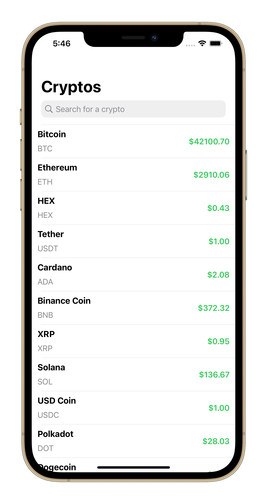

# Cryptex - Simple Cryptocurrencies Tracker

As the title suggests, Cryptex can be used to track current ratio of almost 100 cryptocurrencies. For now it show the rates only in USD. It also have a searching functionality - are you looking for a particular cryptocurrency? No problem, just type its name in the text field. To build it I used mainly UITableView with custom cells. I also used a MVC pattern to structure my whole project.
 
 
 

### Assumptions:
1. No storyboards - only programatic UI,
2. Make my own custom UITableView cells,
3. No 3rd party libraries,
4. Support for both light and dark mode,
5. Use Nomics API to get the data.
 
 
 

### Screenshots

 
 
 

### How to install
1. You will have to get your own Nomics API key and change one method inside NetworkManager.swift file (it is commented, to make it easier).
2. Clone this repo to Xcode.
3. Choose the Simulator.
4. Hit Run button.
